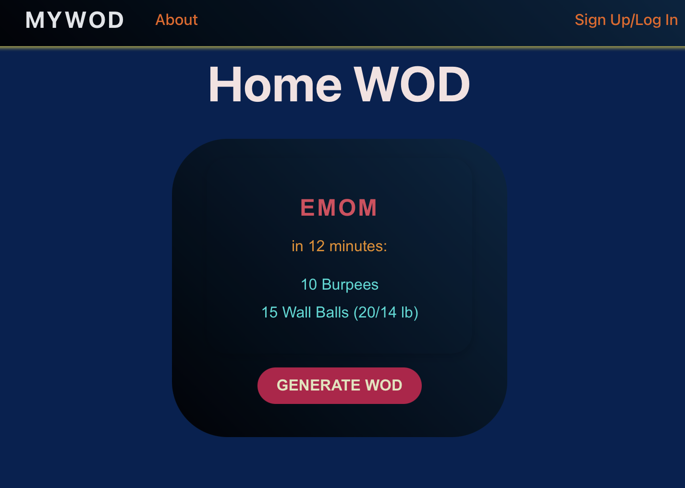
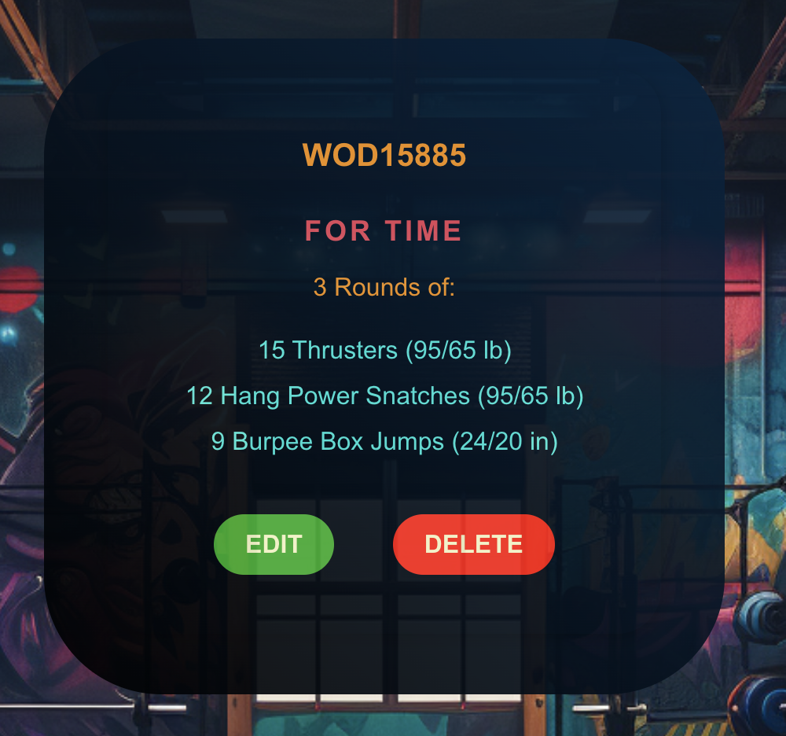

# MyWOD
MyWOD is a fitness application designed to generate CrossFit Workout(s) of the Day (aka WODs). Whether you're a seasoned CrossFit athlete or just starting out, MyWOD has got you covered. 


<details>
<summary>Interesting CrossFit Facts</summary>

- CrossFit was originally created for those in the police and military, but it has since expanded and is taught to the public.
- CrossFit loves to use acronyms, with terms like AMRAP (As Many Rounds/reps As Possible), EMOM (Every Minute On the Minute), RFT (Rounds For Time), Rx (As prescribed in the work out), and many many more! Read about more [here](https://x-tremeathletics.com/meaning-of-crossfit-acronyms/).
- The average WOD takes around 15-20mins but can range from 5mins to over an hour.
- Some CrossFit workouts are named after women, such as "Fran", "Cindy", and "Nancy".
- Some CF workouts are named after fallen veterans (known as Hero WODS) such as "Murph", "Holleyman", "DT", and "Omar".
- Due to the focus on intensity and functional movements, CF is one of the most effective forms of exercise.
- The annual CrossFit Games determine the "Fittest on Earth."

</details>

## Features
- Different effective workouts generated in real time by OpenAI API
- Ability to save the WOD to your list (account needed)
- Modify your saved WODS to match your fitness level
- Simple navigation & easy to use for athletes of all levels

## Getting Started
To begin your CrossFit endevours visit [MyWOD](https://my-wod-5a1017257b43.herokuapp.com/)

At the home page, you'll be presented by the HomeWOD where you can generate a new WOD by clicking on the 'GENERATE WOD' button.



If you want to save and customize the generated WOD, you need to create an account (or login for returning customers) by clicking on "Sign Up/Login" in the navbar.

Once you're logged in, you can save a WOD by selecting the 'SAVE WOD' button. You can see your saved WODS by navigating to the 'MyWODS' in the navbar. 


At the 'MyWODS' page, you can edit or delete your saved WODS.



## Planning
To join our planning process, visit our [Trello board](https://trello.com/b/NrQEYYxS/mywod) to view current and future tasks.

## Technologies
  

## Code Preview
This is an example of using OpenAI API gpt-3.5-turbo to respond to request with a completion that is based on the prompt context.
```js 
async function createWod(req, res) {
  try {
    const response = await fetch(endpoint, {
      method: 'POST',
      headers: {
        'Authorization': `Bearer ${OPENAI_API_KEY}`,
        'Content-Type': 'application/json'
      },
      body: JSON.stringify({
        model: "gpt-3.5-turbo",
        messages: [
          {"role": "system", "content": "You are a fitness assistant."},
          {"role": "user", 
          "content": "Generate only one WOD (either a For Time, AMRAP, or an EMOM) similar to its respective example:\nFor Time\n5 Rounds of:\n12 Deadlifts (155/105 lb)\n9 Hang Power Cleans (155/105 lb)\n6 Push Jerks (155/105 lb)\n\nAMRAP\nin 20 minutes:\n5 Deadlifts (115/75 lb)\n5 Power Cleans (115/75 lb)\n5 Front Squats (115/75 lb)\n5 Push Press (115/75 lb)\n\nEMOM\nin 14 minutes:\nOdd: 10 Thrusters (95/65 lb)\nEven: 20 Kb Swings (53/35 lb)"}
        ],
        temperature: 0.5,
        max_tokens: 260
      })
    });
    const data = await response.json();
    const aiResponseText = data.choices[0].message.content;
    const formattedWod = parseWod(aiResponseText);
    res.status(200).json({ WodResult: aiResponseText, aiGeneratedWod: formattedWod });
  } catch(error) {
    console.error('Error in createWod:', error);
    res.status(500).json({ error: 'Oh my WOD! Internal Server Error' });
  }
}
```

## Next Steps
- Add user friendly videos/illustrations to guide new crossfitters
- Enable custom WOD creations
- Enhance the update feature to add/delete movements
- Generate WOD based on user input to cater to user's preferences
- Ability to see previously generated WODS
- Add dynamic timer function that tracks user's times and saves it to that WOD
- Add user profiles so they can share their WODS
